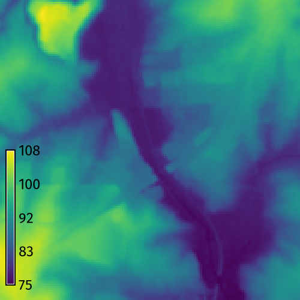
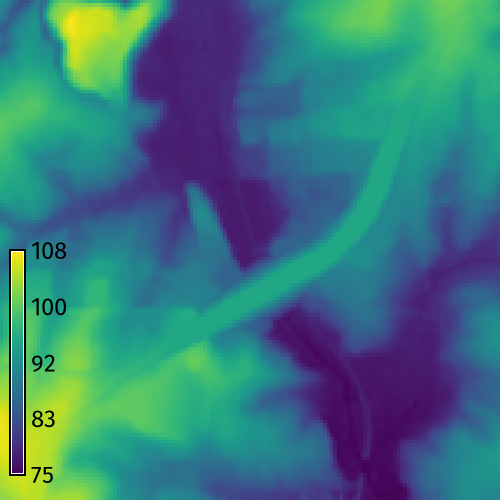
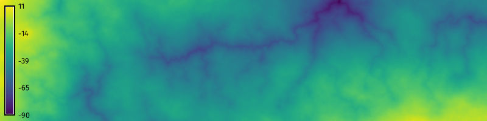
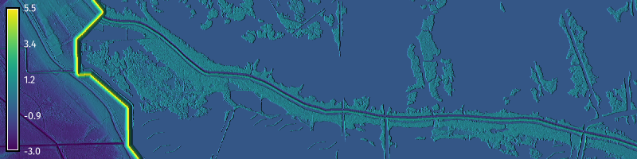
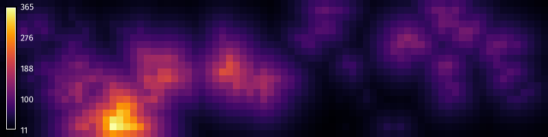

[](https://www.gnu.org/licenses/gpl-3.0)
[](https://doi.org/10.5281/zenodo.15507391)


# r.earthworks

An add-on tool for computational terrain modeling in GRASS.
This is the repository for development version. 
The stable release is in the 
[GRASS Addons Repository](https://github.com/OSGeo/grass-addons).
To learn more see the 
[paper](https://raw.githubusercontent.com/baharmon/r.earthworks/main/paper/paper.pdf),
[documentation](https://grass.osgeo.org/grass85/manuals/addons/r.earthworks.html),
and [tutorials](https://grass-tutorials.osgeo.org/content/tutorials/earthworks/earthworks.html).

## Installation

Install the stable release:
```bash
g.extension  extension=r.earthworks
```

Install the development version:
```bash
g.extension  extension=r.earthworks url=https://github.com/baharmon/r.earthworks
```

## Example

To grade a road crossing over a valley in the
[North Carolina](https://grass.osgeo.org/sampledata/north_carolina/nc_basic_spm_grass7.zip)
sample dataset, run:

```bash
g.region n=217700 s=216200 w=639200 e=640700 res=10
r.earthworks elevation=elevation earthworks=earthworks lines=roadsmajor z=95 function=linear linear=0.25 operation=fill flat=25
r.contour input=earthworks output=contours step=2
```

| Elevation | Earthworks |
| --------- | ---------- |
|  |  |

## Tutorials

**Basic earthworks** 
Learn the basics of terrain modeling with r.earthworks.


**Gully modeling**
Model gullies using relative cut operations.


**Coastal infrastructure**
Model coastal infrastructure projects including levees and restored alluvial ridges.


**Terrain synthesis**
Synthesize terrain by applying landforms from one landscape to another.
