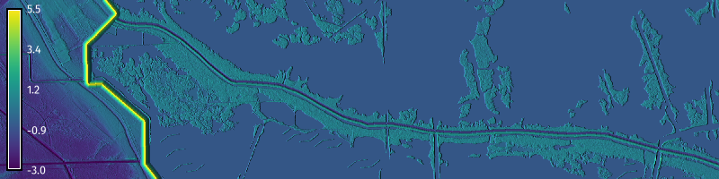
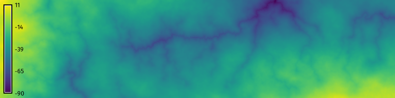

{ width=100% }

# Summary

`r.earthworks` is a tool for modeling terrain in `GRASS`, a free and open source geospatial processing engine [@GRASS]. This tool – inspired by earthworking operations that reshape the earth’s surface – transforms existing terrain rasters. Earthworks are constructed by excavating or embanking soil and rock. In cut operations, earth is removed, dug out by machines such as excavators or pushed away by dozers. In fill operations, earth is added, deposited by machines such as loaders or pushed in place by dozers. `r.earthworks` models topographic change as cut or fill operations that add to or subtract from a topographic surface. Topographic change can be calculated relative to a vertical datum to model features at a given elevation or relative to the topographic surface to model features that follow the terrain. While inspired by earthworking processes, `r.earthworks` can be used to model natural as well as constructed landforms. Applications include procedurally generating terrain (\autoref{fig:figure_1}), designing earthworks (\autoref{fig:figure_2}), modeling landforms (\autoref{fig:figure_3}), simulating processes such as dam or levee breaches, reconstructing historic landscapes, and removing anomalies. As part of the `GRASS` ecosystem, r.earthworks can easily be used in conjunction with other tools for geomorphometry [@Jasiewicz:2013], hydrological modeling [@Mitasova:2004], erosion modeling [@Harmon:2019], and temporal analysis [@Gebbert:2017] in Python scripts and Jupyter notebooks [@Haedrich:2023].

{ width=100% }

# Statement of need

While modeling the shape of the earth’s surface is of interest to many sectors, approaches and thus software vary widely across disciplines. Spatial scientists use remote sensing software, geographic information systems, and geospatial programming to reconstruct real terrain [@Grohmann:2020] and model the physical processes that shape it [@Hobley:2017; @Barnhart:2020]. The computer graphics community uses procedural terrain generators and simulations of physical processes to synthesize novel terrain [@Musgrave:1989; @Galin:2019]. The architecture, engineering, and construction sector uses computer aided design software to model and then build earthworks [@Petschek:2012; @Jud:2021; @Hurkxkens:2019; @Docofossor]. Workflows across disciplines can be complex because of the need to move between modeling paradigms in different, often proprietary software solutions with different data structures. While there are many tools for reconstructing, generating, and transforming terrain, there is a need for free and open source geospatial tools for procedurally reshaping terrain. `r.earthworks` was developed to fill this gap by providing a free and open source tool for transforming terrain that can be used in geospatial programming workflows. It brings terrain modeling concepts from computer graphics and computer aided design into a geospatial modeling and programming environment, eliminating the need for complex workflows across modeling paradigms. `r.earthworks` was designed so that spatial scientists can generate and transform terrain in a geospatial programming environment, providing the geospatial software community with missing capabilities for terrain modeling such as sketching or procedurally modeling landforms from local topographic extrema. 

{ width=100% }

# Functionality

`r.earthworks` functionality includes the transformation of terrain rasters and calculation of volumetric change. Its features include cut and fill operations, relative or absolute datums, growth and decay functions for determining slopes, flats at local minima or maxima, and volumetric calculations. It can be used not only to model basic landforms such as flats, peaks, ridges, shoulders, spurs, slopes, hollows, footslopes, valleys, and pits, but also complex natural and anthropogenic features. 

In `r.earthworks`, terrain – abstracted as a 2-dimensional manifold in 3-dimensional Euclidean space – is represented discretely as a raster grid for efficient storage, analysis, and transformation. Transformations are based on proposed local topographic extrema which can be derived from data, procedurally generated, or sketched. These extrema can be input as coordinates, points, lines, or a raster. The local minima and maxima are modeled as low points for cut operation or high points for fill operations. Transformations are a function of the existing elevation, change in vertical distance, and change in slope over horizontal distance. Vertical distance is calculated as the difference between proposed local extrema and a topographic datum, while change in slope is a function of growth and decay applied to horizontal change in distance. Transformations are calculated independently for each local minima or maxima and are then accumulated before being applied to the existing terrain. 

This tool was designed for use in spatial science workflows working with large terrain datasets. Since `r.earthworks` is raster based, it is efficient, scalable, flexible, and interoperable; it can process large elevation datasets, be used in workflows with other raster-based tools, and its results can be exported in common raster, point cloud, and array formats. After `r.earthworks` has been used to model topographic change, other `GRASS` tools can be used to analyze the resulting terrain and simulate physical processes such as surface flows of water and sediment. Through the `GRASS` Python application programming interface (API), `r.earthworks` can easily be integrated into data science workflows in Python. This tool includes automated tests, documentation, tutorials, and computational notebooks.

# Usage

To model random peaks with `r.earthworks` in Python (\autoref{fig:figure_2}), 
start a `GRASS` session and run the following code:

```python
# Import GRASS package
import grass.script as gs

# Install extension
gs.run_command("g.extension", extension="r.earthworks")

# Set computational region
gs.run_command("g.region", n=500, e=500, s=0, w=0, res=1)

# Generate base terrain
gs.mapcalc("elevation = 0")

# Generate random surface
gs.run_command("r.surf.random", out="surface", min=0, max=25)

# Sample random points
gs.run_command(
    "r.random",
    input="surface",
    npoints=50,
    raster="random",
    flags="s"
    )

# Model earthworks
gs.run_command(
    "r.earthworks",
    elevation="elevation",
    earthworks="earthworks",
    operation="fill",
    raster="random",
    rate=0.25,
    flat=25
    )
```

{ width=100% }

# Acknowledgements
The development of this software benefited from mentorship provided through a program supported by the U.S. National Science Foundation under Grant [2303651](https://www.nsf.gov/awardsearch/showAward?AWD_ID=2303651).

# References