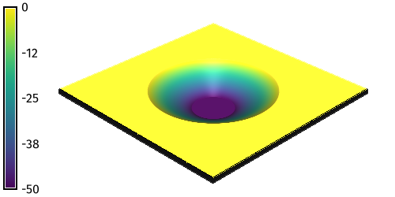
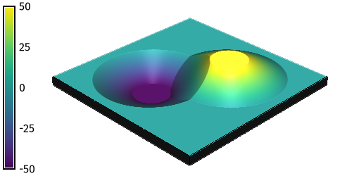
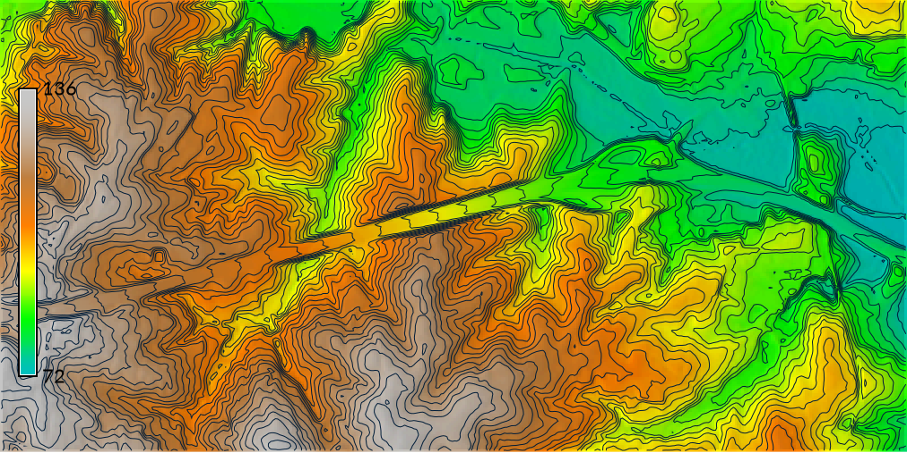
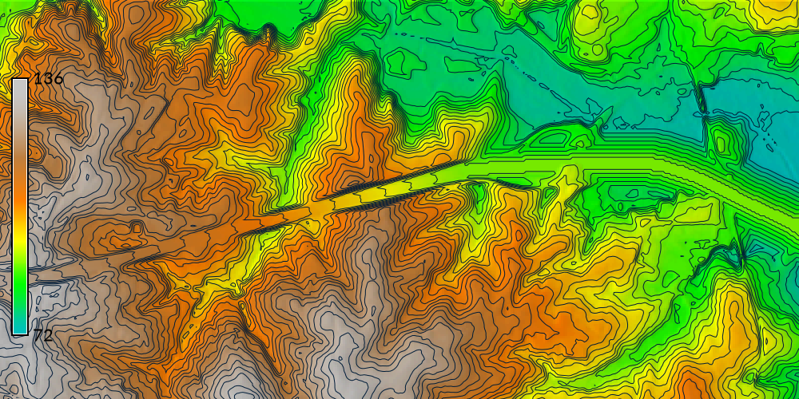

## DESCRIPTION


<!-- ### Acknowledgements -->
<!-- NSF POSE Mentoring -->

<!-- Examples images of cut-fill operations -->

## NOTES
<!-- Size limit -->
<!-- Limit region & patch -->

## EXAMPLES
<!-- Link to computational notebook -->

### Cut & Fill Operations
**Setup**
Set the computational region 
with [`g.region`](https://grass.osgeo.org/grass-stable/manuals/g.region.html)
and then use map algebra to generate a flat terrain 
with [`r.mapcalc`](https://grass.osgeo.org/grass-stable/manuals/r.mapcalc.html).
```sh
g.region n=500 s=0 e=500 w=0 res=1
r.mapcalc expression="elevation = 0"
```

**Fill Operation**
Model a peak from a set of x- and y-coordinates with `r.earthworks`.
Use the z parameter to set a z-coordinate for the top of the peak. 
Optionally use the flat parameter to create a plateau 
at the top of the peak.
```sh
r.earthworks elevation=elevation earthworks=peak operation=fill coordinates=250,250 z=50 rate=0.5 flat=50
```
| Fill | Fill 3D|
| ---- | ------ |
|  |  |

**Cut Operation**
Model a pit from a set of x- and y-coordinates with `r.earthworks`. 
Set a z-coordinate for the bottom of the pit.
```sh
r.earthworks elevation=elevation earthworks=pit operation=cut coordinates=250,250 z=-50 rate=0.5 flat=50
```
| Cut | Cut 3D|
| ---- | ---- |
|  |  |

**Cut & Fill Operation**
Model a pit and a peak from two sets of x- and y-coordinates 
with `r.earthworks`.
Set a z-coordinate for the bottom of the pit 
and another z-coordinate for the top of the peak.
```sh
r.earthworks elevation=elevation earthworks=peak_and_pit operation=cutfill coordinates=180,180,320,320 z=-50,50 rate=0.5 flat=50
```
| Cut & Fill | Cut & Fill 3D|
| ---------- | ------------ |
|  |  |

### Road Grading
Use a vector map of a road network
to grade a road crossing over a valley. 
Start GRASS in the
[North Carolina basic dataset](https://grass.osgeo.org/sampledata/north_carolina/nc_basic_spm_grass7.zip).
First set the computation region with 
[`g.region`](https://grass.osgeo.org/grass-stable/manuals/g.region.html).
Then run `r.earthworks`
with input elevation set to `elevation`,
input lines set to `roadsmajor`,
z set to `95`,
operation set to `fill`,
rate set to `0.25`,
and flat set to `25`.
This will grade an embankment through the valley
with a 50 meter wide roadway
at a constant elevation of 95 meters
with side slopes of 25 percent.
Optionally, compute contours with 
[`r.contour`](https://grass.osgeo.org/grass-stable/manuals/r.contour.html).

```sh
g.region n=217700 s=216200 w=639200 e=640700 res=10
r.earthworks elevation=elevation earthworks=earthworks lines=roadsmajor z=95 rate=0.25 operation=fill flat=25
r.contour input=earthworks output=contours step=2
```
| Elevation | Earthworks |
| --------- | ---------- |
|  |  |

<!-- Print volume of fill -->

When working with a large elevation raster,
set the region to your area of interest
to reduce computation time.
This earthwork can be patched back into the
original elevation raster. 
To do so, first set the region to the extent
of the original elevation raster.
Then run 
[`r.patch`](https://grass.osgeo.org/grass-stable/manuals/r.patch.html)
with the first input raster set to the earthwork raster
and the second input raster set to the original elevation raster.
```sh
g.region raster=elevation
r.patch --overwrite input=earthworks,elevation output=elevation
```

### Simulate Dam Breach

Simulate a flood due to a dam breach with 
[r.lake](https://grass.osgeo.org/grass-stable/manuals/r.lake.html).

```sh
g.region n=223740 s=222740 w=634450 e=635450 res=10
r.lake elevation=elevation water_level=104 lake=lake coordinates=635150.7489931877,223203.9595016748
r.earthworks elevation=elevation operation=cut coordinates=635235.4648198467,223210.9879314204 z=103 rate=0.5 flat=20
r.lake --overwrite elevation=earthworks water_level=104 lake=lake coordinates=635150.7489931877,223203.9595016748
```


<!-- ## TODO -->

<!-- ## KNOWN ISSUES -->

<!-- ## REFERENCES -->

<!-- ## SEE ALSO -->

## AUTHORS
[Brendan Harmon](https://baharmon.github.io/)