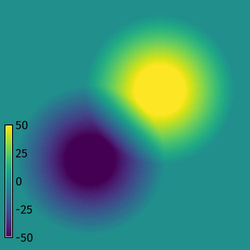
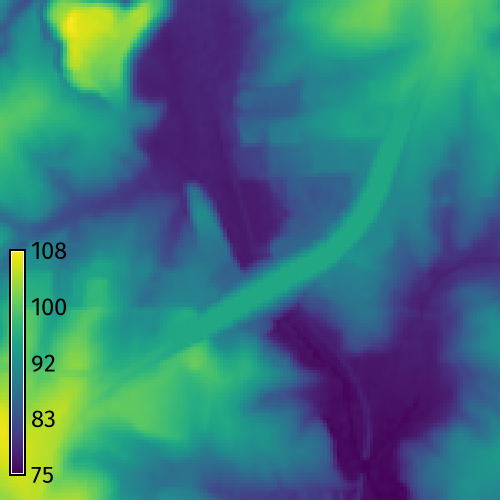

## DESCRIPTION

*r.earthworks* models new landforms
using cut and fill operations
to add and remove earth
from an elevation raster.
It can be used to model topographic forms
such as  hills, pits, ridges, valleys,
roads, dams, and levees.
In cut operations
earth is excavated from the elevation raster,
while in fill operations
earth is deposited on the elevation raster.
In absolute mode
earth is added or removed
until the specified elevation is reached,
while in relative mode
earth is added or removed
by a height relative to the existing terrain.
Slope is determined by a growth and decay function
which can be set to
linear, exponential, logistic,
Gaussian, Cauchy-Lorentz,
quadratic, or cubic
and then parameterized.

### Inputs

The key inputs for *r.earthworks*
are an existing elevation raster
and a set of x-, y-, and z-values
for the local minima and maxima
of the new landforms.
These values can be input as
`coordinates`, `points`, `lines`, or a `raster`.
For x- and y-coordinates, 2D points, and 2D lines,
an input elevation parameter `z`
must also be specified.
This `z` parameter can be
a single constant value
or a list of values.
Other input parameters
for *r.earthworks* include
operation, mode, function, slope, and flats.
The `operation` parameter can be set to
cut, fill, or cut-fill mode
to excavate, build, or excavate and build terrain.
The `mode` parameter can be set to
absolute or relative mode
to use either zero or
the existing elevation as a datum.
In absolute mode, for example,
a road would cut through
or be built up on embankments over
the existing terrain,
while in relative mode
a road would adapt to the terrain.
The `function` parameter can be set to
linear, exponential, logistic,
Gaussian, Cauchy-Lorentz,
quadratic, or cubic
to define the slope
from the local minima or maxima
to the existing terrain.
A slope parameter - either
`linear`,
`exponential`,
`logistic`,
`gaussian`,
`lorentz`,
`quadratic`, or
`cubic` -
specifies the
rate of growth and decay
for a given slope function.
For example a linear slope function
with a rate of 0.1
will generate a constant 10 percent slope.
The `flats` parameter specifies the radius
of constant elevation around local minima or maxima.
It can be used to model the flat surfaces
of topographic features such as
plateaus, lakes, roads, and levees.

### Outputs

In addition to generating an `earthworks` raster
with transformed elevation values,
*r.earthworks* can also calculate
the volume of cut and fill.
Set the output `volume` raster
to generate a volumetric change raster.
Use the `-p` flag
to print the net volume of cut and fill.

### Quadtree Segmentation

To speed computation,
*r.earthworks* uses quadtree segmentation.
The computational region is recursively divided into quadrants
until each quadrant contains no more a given number of coordinates
defined by a `threshold` parameter.
Quadtree segmentation limits earthworking operations
to quadrants containing input geometry.
Each segmented subregion is grown by a `border` parameter
which has a default value of 250 map units.
If this border is not large enough,
then the earthworking operations may be incomplete
with artifacts along their edges.
If artifacts occur, then increase the size of the border.
A larger border, however, will increase computation time.
When the initial region contains a hundred thousand cells or more
and there are more input coordinates than the threshold,
quadtree segmentation is used by default,
but can be disabled with flag `-d`.
When segmentation is not used,
it can take a long time to model extensive earthworks
for large regions with a million cells or more.

## EXAMPLES

For more detailed instructions and examples, see the
[earthworks](https://grass-tutorials.osgeo.org/content/tutorials/earthworks/earthworks.html)
tutorial collection.

### Cut & Fill Operations

Perform basic cut and fill operations
to model peaks and pits from x- and y-coordinates.

**Setup**
Set the computational region
with [*g.region*](https://grass.osgeo.org/grass-stable/manuals/g.region.html)
and then use map algebra to generate a flat terrain
with [*r.mapcalc*](https://grass.osgeo.org/grass-stable/manuals/r.mapcalc.html).

```sh
g.region n=500 s=0 e=500 w=0 res=1
r.mapcalc expression="elevation = 0"
```

**Fill Operation**
Model a peak from a set of x- and y-coordinates with *r.earthworks*.
Use the z parameter to set a z-coordinate for the top of the peak.
Optionally use the flat parameter to create a plateau
at the top of the peak.

```sh
r.earthworks elevation=elevation earthworks=peak operation=fill coordinates=250,250 z=50 function=linear linear=0.5 flat=50
```

| Fill | Fill 3D|
| ---- | ------ |
|  |  |

**Cut Operation**
Model a pit from a set of x- and y-coordinates with *r.earthworks*.
Set a z-coordinate for the bottom of the pit.

```sh
r.earthworks elevation=elevation earthworks=pit operation=cut coordinates=250,250 z=-50 function=linear linear=0.5 flat=50
```

| Cut | Cut 3D|
| ---- | ---- |
|  |  |

**Cut & Fill Operation**
Model a pit and a peak from two sets of x- and y-coordinates
with *r.earthworks*.
Set a z-coordinate for the bottom of the pit
and another z-coordinate for the top of the peak.

```sh
r.earthworks elevation=elevation earthworks=peak_and_pit operation=cutfill coordinates=180,180,320,320 z=-50,50 function=linear linear=0.5 flat=50
```

| Cut & Fill | Cut & Fill 3D|
| ---------- | ------------ |
|  |  |

### Road Grading

Use a vector map of a road network
to grade a road crossing over a valley.
Start GRASS in the
[North Carolina basic dataset](https://grass.osgeo.org/sampledata/north_carolina/nc_basic_spm_grass7.zip).
First set the computation region with
[*g.region*](https://grass.osgeo.org/grass-stable/manuals/g.region.html).
Then run *r.earthworks*
with input elevation set to `elevation`,
input lines set to `roadsmajor`,
z set to `95`,
operation set to `fill`,
function set to `linear`,
linear set to `0.25`,
and flat set to `25`.
Use flag `-p` to print the volume of fill.
This will grade an embankment through the valley
with a 50 meter wide roadway
at a constant elevation of 95 meters
with side slopes of 25 percent.
Optionally, compute contours with
[*r.contour*](https://grass.osgeo.org/grass-stable/manuals/r.contour.html).

```sh
g.region n=217700 s=216200 w=639200 e=640700 res=10
r.earthworks elevation=elevation earthworks=earthworks lines=roadsmajor z=95 function=linear linear=0.25 operation=fill flat=25 -p
r.contour input=earthworks output=contours step=2
```

| Elevation | Earthworks |
| --------- | ---------- |
|  |  |

When working with a large elevation raster,
set the region to your area of interest
to reduce computation time.
This earthwork can be patched back into the
original elevation raster.
To do so, first set the region to the extent
of the original elevation raster.
Then run
[*r.patch*](https://grass.osgeo.org/grass-stable/manuals/r.patch.html)
with the first input raster set to the earthwork raster
and the second input raster set to the original elevation raster.

```sh
g.region raster=elevation
r.patch --overwrite input=earthworks,elevation output=elevation
```

### Dam Breach Modeling

Model a flood due to a dam breach.
Use *r.earthworks* to breach the dam
and then use
[*r.lake*](https://grass.osgeo.org/grass-stable/manuals/r.lake.html)
to model the maximum possible extent and depth of flooding.

```sh
g.region n=223740 s=222740 w=634450 e=635450 res=10
r.lake elevation=elevation water_level=104 lake=lake coordinates=635150.7489931877,223203.9595016748
r.earthworks elevation=elevation operation=cut coordinates=635235.4648198467,223210.9879314204 z=103 function=linear linear=0.5 flat=20
r.lake --overwrite elevation=earthworks water_level=104 lake=lake coordinates=635150.7489931877,223203.9595016748
```

| Dam | Dam Breach |
| --------- | ---------- |
|  |  |

## NOTES

In GRASS 8.5 and above,
map algebra uses parallel computing
for faster raster calculations.
The current implementation
of parallelization in r.mapcalc
can open too many files
causing *r.earthworks* to fail
for runs with multiple input coordinates
depending on the open file limit of the user's system.
This issue can be addressed
by enabling quadtree segmentation,
setting fewer threads for parallel computing,
or raising the open file limit.
If this error occurs, try setting
smaller `threshold` and `border` parameters
for quadtree segmentation.
Alternatively, try setting
the number of threads for parallel computing
with the `nprocs` parameter.
Use the shell command `ulimit`
to temporarily raise the open file limit:

```bash
ulimit -S -n 32768
```

## REFERENCES

* Harmon, B., Petrasova, A., and Petras, V. (2025).
    [r.earthworks: a GRASS tool for terrain modeling][1] \[Preprint\].
* Harmon, B. (2025). [r.earthworks][2] (Version 2.0.0) \[Computer software\].

[1]: https://github.com/baharmon/r.earthworks/blob/main/paper/paper.pdf

[2]: https://doi.org/10.5281/zenodo.15507392

## AUTHORS

[Brendan Harmon](https://baharmon.github.io/)
